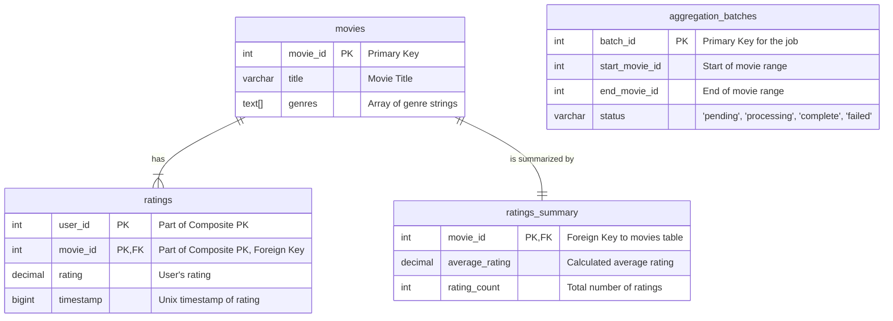
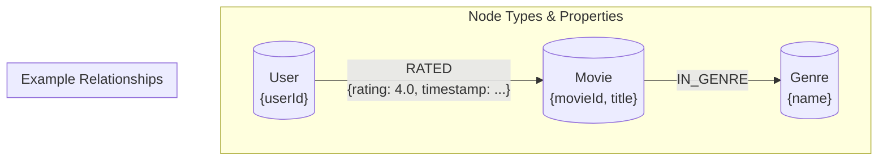
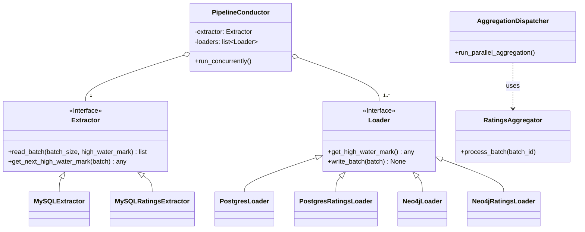
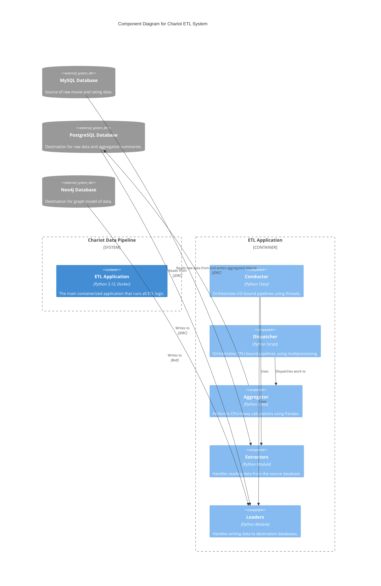
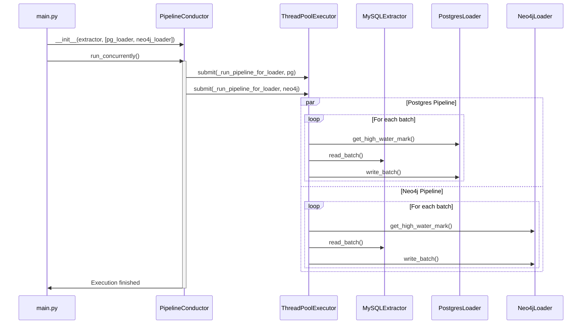
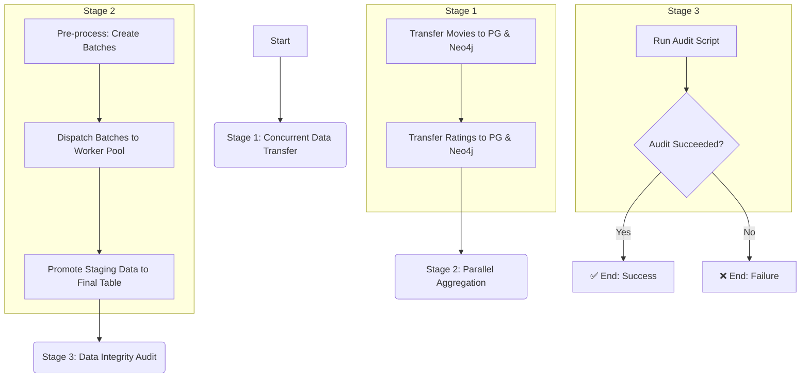

# Chariot: A Modular, Multi-Target, Parallel Data Pipeline

**"Chariot" is a demonstration of a professional data engineering project. This pipeline reliably transfers and aggregates data from a source database (MySQL) to multiple, disparate destinations (PostgreSQL and Neo4j) using a concurrent and parallel-processing framework.**

---

## About The Project

This is not just a simple script; it's a small framework built on professional principles. It performs two main operations in sequence:

1.  **Concurrent Data Transfer:** A multi-threaded pipeline reads raw data from MySQL and loads it into both PostgreSQL and Neo4j *concurrently*.
2.  **Parallel Data Aggregation:** A multi-process pipeline reads the raw data from PostgreSQL, performs a CPU-intensive aggregation, and loads the results back into a summary table.

### Key Architectural Features

*   **Fully Containerized:** The entire environment, including all services (Python App, MySQL, PostgreSQL, Neo4j), is managed by Docker and Docker Compose. The only prerequisite is Docker.
*   **Pluggable & Modular:** The design is built on abstract `Extractor` and `Loader` interfaces. This allows new data sources or destinations to be added with minimal effort.
*   **Idempotent & Fault-Tolerant:**
    *   The raw data transfer uses a **high-water mark** strategy (supporting both single and composite keys) to be safely restartable.
    *   The advanced aggregation pipeline uses a **job control table** to manage state, allowing it to be resumed if interrupted.
*   **Optimized for Performance:**
    *   **Concurrency for I/O:** The initial data transfer uses a `ThreadPoolExecutor` to run I/O-bound tasks concurrently, loading to PostgreSQL and Neo4j at the same time.
    *   **Parallelism for CPU:** The ratings aggregation pipeline uses a `multiprocessing.Pool` to distribute the CPU-bound calculation work across all available CPU cores for true parallel execution.
*   **Configuration Driven:** All sensitive information (credentials) and parameters (batch sizes) are managed via a `.env` file and a typed Pydantic settings model.
*   **Robust Testing & Validation:** The project includes a full `pytest` suite and a separate, comprehensive **data integrity audit script** that validates the raw data transfer and the results of the final aggregation.

### Architecture Diagram

```
                                          ┌────────────────────┐
                                          |                    |
                                    ┌─────►   PostgreSQL DB    │
                                    │     │  (Relational Sink) │
                                    │     └──────────▲─────────┘
                                    │                │
┌──────────────────┐      ┌─────────┴──┐             │ (Aggregates)
│                  │      │  Concurrent│             │
│   MySQL DB       ├──────► (I/O-Bound)├─────────────┤
│  (Source)        │      │  Data Sync │             │
│                  │      └─────────┬──┘             │
└──────────────────┘                │                │
                                    │     ┌──────────▼─────────┐
                                    │     │   Parallel         │
                                    └─────►   (CPU-Bound)      │
                                          │   Aggregation      │
                                          └──────────┬─────────┘
                                                     │
                                          ┌──────────▼─────────┐
                                          │                    │
                                          │   Neo4j DB         │
                                          │   (Graph Sink)     │
                                          └────────────────────┘
```

### Built With

*   **Backend:** Python 3.12
*   **Orchestration:** Docker, Docker Compose
*   **Databases:**
    *   MySQL 8.0 (Source)
    *   PostgreSQL 16 (Destination)
    *   Neo4j 5 (Destination)
*   **Key Python Libraries:**
    *   `pydantic` for settings management
    *   `structlog` for structured logging
    *   `pandas` & `numpy` for high-performance aggregation
    *   `multiprocessing` for parallel processing
    *   `pytest` for testing

---

## Getting Started

To get a local copy up and running, follow these simple steps.

### Prerequisites

*   Docker: [https://www.docker.com/get-started](https://www.docker.com/get-started)

### How to Run

1.  **Clone the repository:**
    ```sh
    git clone https://github.com/zhu-weijie/chariot-data-pipeline.git
    cd chariot-data-pipeline
    ```

2.  **Create the Environment File:**
    Rename the example environment file to `.env`.
    ```sh
    cp .env.example .env
    ```

3.  **Build and Start the Services:**
    This command will build the Python image and start all database and application containers in the background. It will automatically populate the MySQL database with the MovieLens dataset.
    ```sh
    docker compose up --build -d
    ```
    *Wait about 30 seconds for all database services to become healthy.*

---

## Usage

You can run the main ETL pipeline, the testing suite, or the data audit script using `docker compose`.

### 1. Run the Full ETL & Aggregation Pipeline

This single command executes the main conductor, which will run all stages of the pipeline in the correct order.

```sh
docker compose run --rm python_app python main.py
```

### 2. Run the Data Integrity Audit

This script runs *after* the main pipeline is complete. It samples data from all three databases to verify that the initial transfer and the final aggregation were both correct.

```sh
docker compose run --rm python_app python audit.py
```
You should see an `✅ Audit PASSED` message at the end.

### 3. Run the Test Suite

This command runs all unit and integration tests using `pytest`.

```sh
docker compose run --rm python_app pytest
```
You should see all tests passing.

### 4. Shut Down the Environment

When you are finished, this command will stop and remove all containers and networks. To also remove the database data volumes, add the `-v` flag.

```sh
docker compose down -v
```

## Design Diagrams

### Relational Model



### Graph Model



### Class Diagram



### C4 Component Diagram



### Sequence Diagram



### Process Flowchart


