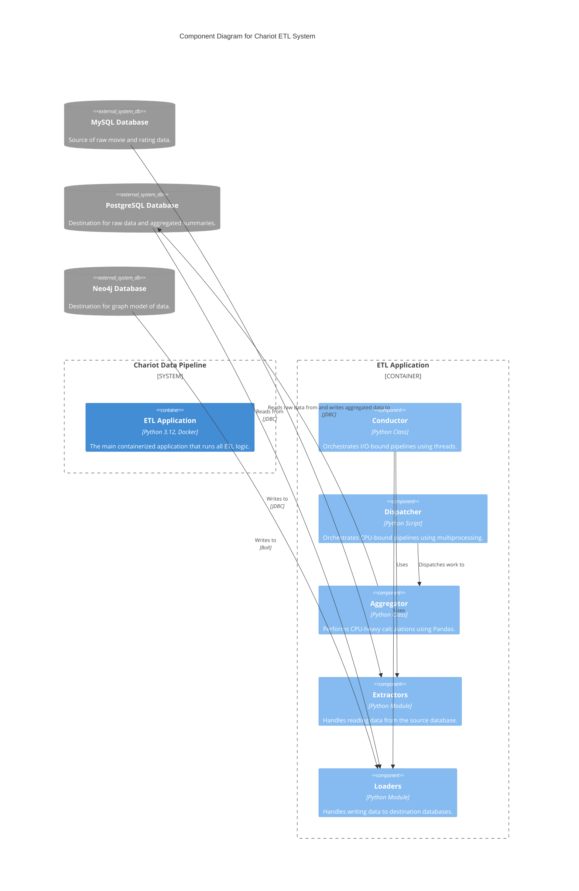

```mermaid
C4Component
    title Component Diagram for Chariot ETL System

    System_Boundary(chariot_system, "Chariot Data Pipeline") {
        Container(python_app, "ETL Application", "Python 3.12, Docker", "The main containerized application that runs all ETL logic.")
    }
    
    Container_Boundary(python_app_boundary, "ETL Application") {
        Component(conductor, "Conductor", "Python Class", "Orchestrates I/O-bound pipelines using threads.")
        Component(dispatcher, "Dispatcher", "Python Script", "Orchestrates CPU-bound pipelines using multiprocessing.")
        Component(aggregator, "Aggregator", "Python Class", "Performs CPU-heavy calculations using Pandas.")
        Component(extractors, "Extractors", "Python Module", "Handles reading data from the source database.")
        Component(loaders, "Loaders", "Python Module", "Handles writing data to destination databases.")
    }
    
    SystemDb_Ext(mysql, "MySQL Database", "Source of raw movie and rating data.")
    SystemDb_Ext(postgres, "PostgreSQL Database", "Destination for raw data and aggregated summaries.")
    SystemDb_Ext(neo4j, "Neo4j Database", "Destination for graph model of data.")

    Rel(conductor, extractors, "Uses")
    Rel(conductor, loaders, "Uses")

    Rel(dispatcher, aggregator, "Dispatches work to")
    
    Rel(aggregator, postgres, "Reads raw data from and writes aggregated data to", "JDBC")

    Rel_Back(extractors, mysql, "Reads from", "JDBC")
    Rel_Back(loaders, postgres, "Writes to", "JDBC")
    Rel_Back(loaders, neo4j, "Writes to", "Bolt")
```
