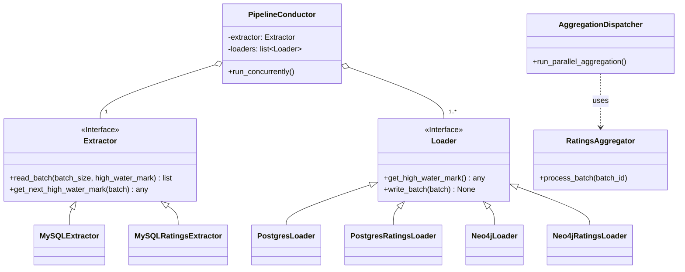

```mermaid
classDiagram
    class Extractor {
        <<Interface>>
        +read_batch(batch_size, high_water_mark) list
        +get_next_high_water_mark(batch) any
    }

    class Loader {
        <<Interface>>
        +get_high_water_mark() any
        +write_batch(batch) None
    }

    Extractor <|-- MySQLExtractor
    Extractor <|-- MySQLRatingsExtractor
    
    Loader <|-- PostgresLoader
    Loader <|-- PostgresRatingsLoader
    Loader <|-- Neo4jLoader
    Loader <|-- Neo4jRatingsLoader

    class PipelineConductor {
        -extractor: Extractor
        -loaders: list~Loader~
        +run_concurrently()
    }

    PipelineConductor o-- "1" Extractor
    PipelineConductor o-- "1..*" Loader

    class AggregationDispatcher {
        +run_parallel_aggregation()
    }

    class RatingsAggregator {
        +process_batch(batch_id)
    }

    AggregationDispatcher ..> RatingsAggregator : uses
```
