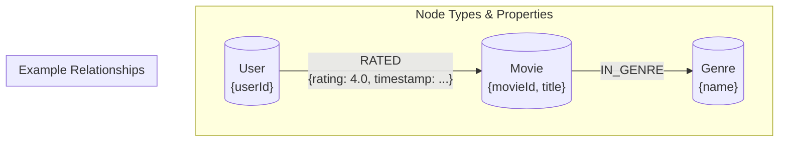

```mermaid
graph TD
    subgraph "Node Types & Properties"
        U[("User <br/> {userId}")];
        M[("Movie <br/> {movieId, title}")];
        G[("Genre <br/> {name}")];
    end

    subgraph "Example Relationships"
        U -- "RATED <br/> {rating: 4.0, timestamp: ...}" --> M;
        M -- "IN_GENRE" --> G;
    end
```
