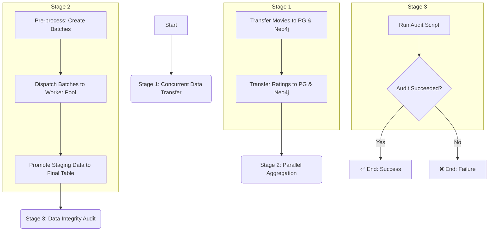

```mermaid
graph TD
    A[Start] --> B(Stage 1: Concurrent Data Transfer);
    
    subgraph Stage 1
        B1[Transfer Movies to PG & Neo4j] --> B2[Transfer Ratings to PG & Neo4j];
    end

    B2 --> C(Stage 2: Parallel Aggregation);
    
    subgraph Stage 2
        C1[Pre-process: Create Batches] --> C2[Dispatch Batches to Worker Pool];
        C2 --> C3[Promote Staging Data to Final Table];
    end
    
    C3 --> G(Stage 3: Data Integrity Audit);
    
    subgraph Stage 3
        G1[Run Audit Script] --> G2{Audit Succeeded?};
    end

    G2 -- Yes --> H[✅ End: Success];
    G2 -- No --> I[❌ End: Failure];
```
