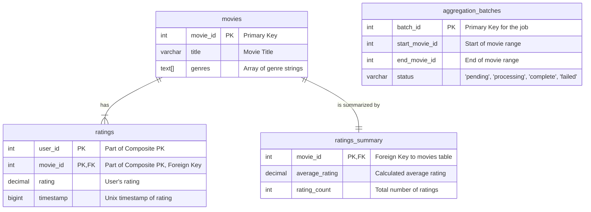

```mermaid
erDiagram
    movies {
        int movie_id PK "Primary Key"
        varchar title "Movie Title"
        text[] genres "Array of genre strings"
    }

    ratings {
        int user_id PK "Part of Composite PK"
        int movie_id PK, FK "Part of Composite PK, Foreign Key"
        decimal rating "User's rating"
        bigint timestamp "Unix timestamp of rating"
    }

    aggregation_batches {
        int batch_id PK "Primary Key for the job"
        int start_movie_id "Start of movie range"
        int end_movie_id "End of movie range"
        varchar status "'pending', 'processing', 'complete', 'failed'"
    }
    
    ratings_summary {
        int movie_id PK, FK "Foreign Key to movies table"
        decimal average_rating "Calculated average rating"
        int rating_count "Total number of ratings"
    }

    movies ||--|{ ratings : "has"
    movies ||--|| ratings_summary : "is summarized by"
```
