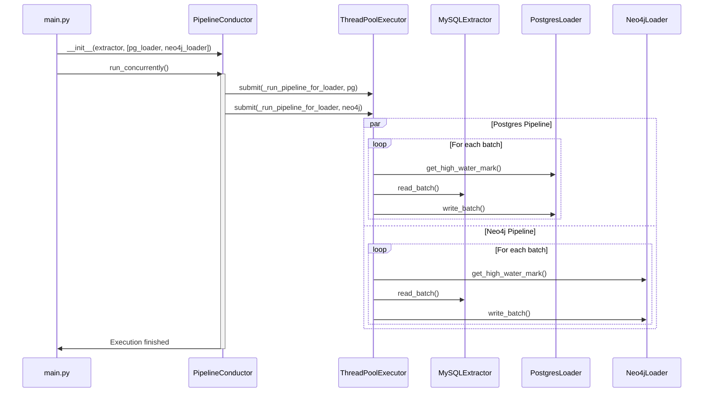

```mermaid
sequenceDiagram
    participant main as main.py
    participant conductor as PipelineConductor
    participant executor as ThreadPoolExecutor
    participant mysql as MySQLExtractor
    participant pg as PostgresLoader
    participant neo4j as Neo4jLoader

    main->>conductor: __init__(extractor, [pg_loader, neo4j_loader])
    main->>conductor: run_concurrently()
    activate conductor
    
    conductor->>executor: submit(_run_pipeline_for_loader, pg)
    conductor->>executor: submit(_run_pipeline_for_loader, neo4j)

    par Postgres Pipeline
        loop For each batch
            executor->>pg: get_high_water_mark()
            executor->>mysql: read_batch()
            executor->>pg: write_batch()
        end
    and Neo4j Pipeline
        loop For each batch
            executor->>neo4j: get_high_water_mark()
            executor->>mysql: read_batch()
            executor->>neo4j: write_batch()
        end
    end
    
    conductor->>main: Execution finished
    deactivate conductor
```
